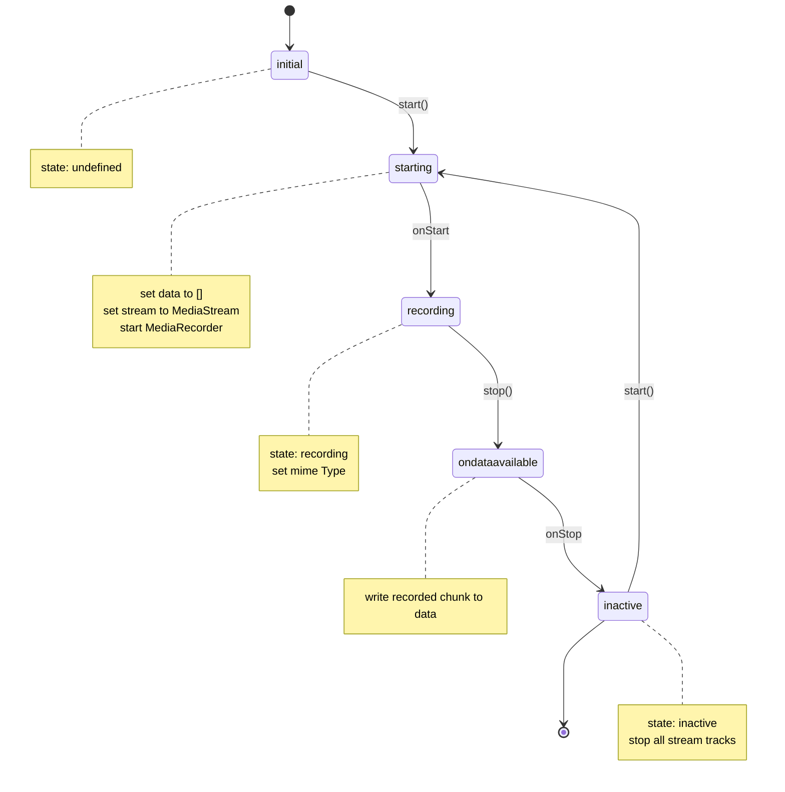
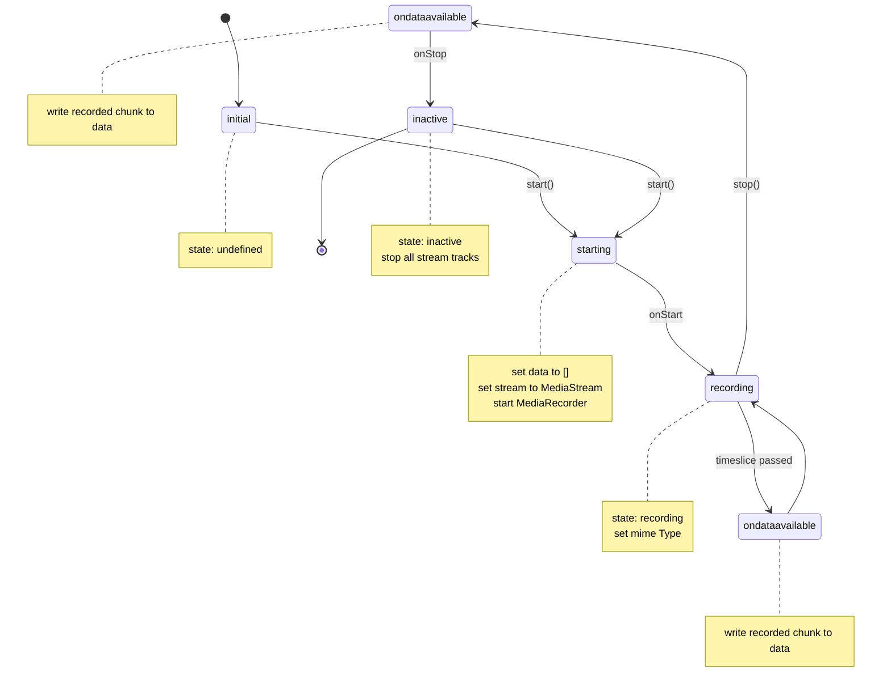

# Best Practice

## Lifecycle

The `useMediaRecorder` composable is a wrapper around the `MediaRecorder` API. It provides a simple interface to start,
pause, resume, and stop recording. The composable is designed to be as close as possible to the native API.

Although `stop()`, `pause()` and `resume()` are synchronous operations, they just trigger some delayed events. The
actual lifecycle of the `MediaRecorder` is "asynchronous".

:::info
You should always wait for the actual event to be triggered before you access the data.
:::

### `start()` without timeslice and `stop()`

If you don't pass a `timeslice` to `start()`, the `MediaRecorder` will record the stream until you call `stop()`.
This does mean that you need to wait for the `onStop` callback to be called before you can access the recorded data.

```ts
const { start, stop } = useMediaRecorder({
  onStart: () => console.log('started'),
  onStop: () => console.log('stopped')
})

await start()
stop()
```



### `start()` with timeslice and `stop()`

If you pass a `timeslice` to `start()`, the `MediaRecorder` will record the stream and write the recorded data to the
`data` array every `timeslice` milliseconds. After you call `stop()`, it will call one last `ondataavailable` event and
then call `onStop`. This means you should wait for the `onStop` callback to be called before you can access **all** the
recorded

```ts
const { start, stop } = useMediaRecorder({
  onStart: () => console.log('started'),
  onStop: () => console.log('stopped')
})

await start(10)
stop()
```



## Limitations

### Reactive `constraints` and `mediaRecorderOptions`

The `constraints` and `mediaRecorderOptions` accept reactive values. **However**, changing these values will not
automatically update the `MediaRecorder`. You need to call `stop()` and `start()` again to apply the new values.

### `mimeType` and `isMimeTypeSupported`

The `mimeType` is set when the `MediaRecorder` is initialized and the stream is available (start has to be called once).

If you set the `mimeType` manually, make sure that the `mimeType` is supported by the browser. You can
check if the `mimeType` is supported via `isMimeTypeSupported`.

```ts
const { mimeType, isMimeTypeSupported } = useMediaRecorder({
  mediaRecorderOptions: {
    mimeType: 'video/webm;codecs=vp9'
  }
})

console.log(mimeType.value, isMimeTypeSupported.value)
```

::: warning
`isMimeTypeSupported` will check your `mediaRecorderOptions.mimeType` and not the actual `mimeType` of the
`MediaRecorder`. **But** `mimeType` will be set to the actual `mimeType` of the `MediaRecorder`.

So it's possible to have `isMimeTypeSupported.value === true` and `mimeType.value === undefined`.
:::
